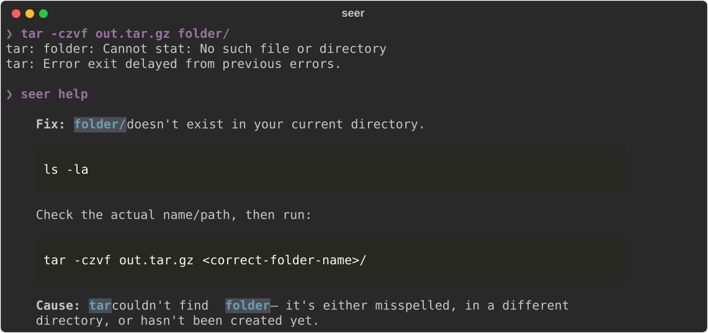
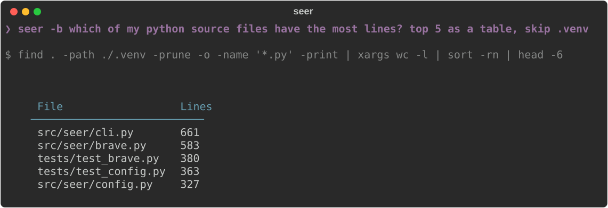
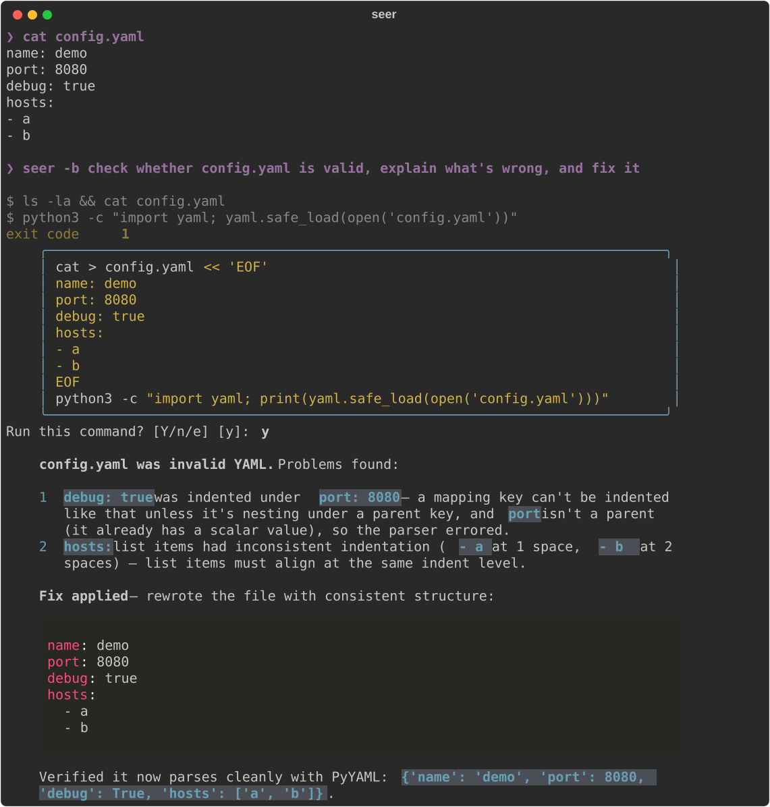

# SEER — Shell Enhanced Execution & Reasoning


**An AI assistant that lives in your terminal.** It sees what just went wrong and tells you how to fix it. It answers shell questions. In brave mode, it does the job for you.



## Why seer

- **No copy-pasting errors.** `seer help` reads your recent terminal output and explains the last failure.
- **It can do the work.** Brave mode runs the commands it needs, reads the results, and answers: tables, summaries, fixes.
- **Safe by default.** Read-only commands run on their own. Anything that changes something asks first, and you see the whole command.
- **Your choice of model.** Local (LM Studio, Ollama, llama.cpp, vLLM), OpenAI, Anthropic, or your Claude Code / Codex subscription. seer picks up a running local server automatically.
- **Plain English at the prompt.** Type what you want and press `Ctrl+G`.

macOS and Linux · zsh and bash · inspired by [PEEL](https://github.com/lemonade-sdk/peel) for PowerShell.

---

## Quick start

**1. Install**

```bash
curl -fsSL https://raw.githubusercontent.com/zeddius1983/seer/main/install.sh | bash
source ~/.zshrc
```

This installs `seer` (and `uv` if needed), the zsh integration and `Ctrl+G`. On bash, add `source "$(seer --shell-path bash)"` to `~/.bashrc` instead.

**2. Connect a model.** Start [LM Studio](https://lmstudio.ai) or [Ollama](https://ollama.com) with any model and seer finds it. For something else, see [Choosing a model](#choosing-a-model). Check with:

```bash
seer --stats
```

**3. Use it**

```bash
seer help                          # after something fails: what went wrong, and the fix
seer how do I find what is using port 8080
seer -b what is taking up space in my home folder
```

---

## Brave mode: let seer do it

Add `-b` and seer works out the commands, runs them, and answers with the result. Each command is shown as it runs.



It handles tasks that need several steps, where each step depends on what the last one found:

```bash
seer -b find the 5 largest files here and show them as a table
seer -b which file changed most in the last 20 commits, and what were its last 3 changes about
seer -b which of my python files has the most lines, and what does it import
seer -b what is listening on network ports, and which process owns each
seer -b find log files older than 30 days, tell me how much space they take, and compress them
seer -b check whether config.yaml is valid, explain what is wrong, and fix it
seer -b write a zfs cheatsheet and save it to ~/Documents as markdown
```

**Anything that changes something asks first.** You see the whole command in a box and answer `y`, `n`, or `e` to edit it. If you answer `n`, seer stops and tells you what it would have run.



To make brave mode the default for every question, including `Ctrl+G`, add this to `~/.config/seer/config.yaml`:

```yaml
brave: true
brave_confirm: auto   # when to ask first: auto | trust | always
```

| `brave_confirm` | Asks before running |
|---|---|
| `auto` (default) | anything not known to be read-only |
| `trust` | only destructive commands: `rm`, `mv`, `sudo`, `> file`, `sed -i`, `git push`/`reset`, installs, … |
| `always` | every command |

<details>
<summary>How brave mode stays safe</summary>

- seer checks each command itself before running it. It doesn't just take the model's word that a command is safe. In `auto` mode only an allowlist of read-only commands runs without asking. Commands like `find -exec`, `xargs`, `sed` and `awk` count as read-only only when what they run or edit is also read-only.
- The model also marks commands it knows will change something, and those always ask. The model can add confirmations but never skip them, because text in a file or a web page could try to talk it into something harmful.
- Commands run in your current directory with no input and a 60s timeout, for at most 6 steps. `Ctrl+C` stops at any point.
- `seer --no-brave <question>` turns brave mode off for one question. `seer help`, `seer do` and piped input never use it.
- Brave mode needs a capable model. It was tested with Claude Sonnet. Very small local models (~2B) tend to lose track after a few steps.

</details>

---

## Everyday use

| You type | seer does |
|---|---|
| `seer help` | Explains the last error in your terminal and how to fix it |
| `seer <question>` | Answers any shell question |
| `seer -b <task>` | Does the task and shows the result ([brave mode](#brave-mode-let-seer-do-it)) |
| `seer do <task>` | Suggests one command and runs it if you confirm |
| *question* + `Ctrl+G` | Same as `seer <question>`, straight from the prompt (zsh) |
| `cmd 2>&1 \| seer` | Explains that command's output |
| `tail -f app.log \| seer` | Watches a live stream and flags problems every 15s |

**Useful flags:** `-s` streams the answer as it's written · `-r` gives plain text for scripts · `-p <provider>` / `-m <model>` switch the model for one question · `--no-context` skips your terminal output.

**Diagnostics:** `seer --stats` shows the active model and settings, `seer --context` shows exactly what gets sent, and `seer config` prints your config file.

---

## Choosing a model

With `provider: auto` (the default), seer uses the first local server it finds: llama.cpp, LM Studio, Ollama, then vLLM. To use something else, set it in `~/.config/seer/config.yaml` (run `seer config` to create it):

```yaml
provider: anthropic        # or: openai, ollama, lmstudio, claude-cli, …
```

| Provider | `provider:` | Setup |
|---|---|---|
| [LM Studio](https://lmstudio.ai), [Ollama](https://ollama.com), [llama.cpp](https://github.com/ggerganov/llama.cpp), [vLLM](https://github.com/vllm-project/vllm) | `lmstudio`, `ollama`, `llamacpp`, `vllm` | Just start the server |
| [OpenAI](https://platform.openai.com) | `openai` | `OPENAI_API_KEY` |
| [Anthropic](https://anthropic.com) | `anthropic` | `ANTHROPIC_API_KEY` |
| [Claude Code](https://code.claude.com) / [Codex](https://developers.openai.com/codex) CLI | `claude-cli`, `codex-cli` | Installed and signed in. Uses your subscription |
| Any OpenAI-compatible server | a name you add | `type: openai` + `base_url` |

<details>
<summary>Using your Claude Code or Codex subscription</summary>

If you have Claude Code or Codex installed and signed in, seer can use it instead of an API key. This is **off by default**:

```yaml
provider: claude-cli     # use it always…
auto_cli: true           # …or only when no local server is running (claude-cli, then codex-cli)

providers:
  claude-cli:
    type: claude-cli
    model: sonnet        # haiku / sonnet / opus, or a full model id
  codex-cli:
    type: codex-cli
    model: [gpt-6-luna, auto]   # tried in order; auto = your ~/.codex/config.toml model
    reasoning_effort: low
```

- seer runs the official `claude -p` / `codex exec` binary, which signs in with your own account. seer never touches your credentials.
- The CLI runs with its tools switched off, so it only answers. When brave mode runs commands, seer runs them, never the CLI.
- Requests count against your plan's limits. `claude-cli` answers in a few seconds; `codex-cli` takes about 10s.
- This use is subject to [Anthropic's](https://code.claude.com/docs/en/legal-and-compliance) and [OpenAI's](https://openai.com/policies/terms-of-use/) terms. If you want no ambiguity, use the `anthropic` / `openai` providers with an API key.

</details>

<details>
<summary>Custom server or model</summary>

```yaml
provider: myserver
providers:
  myserver:
    type: openai                     # any OpenAI-compatible API
    base_url: http://myserver:8080/v1
    api_key: none
    model: my-model                  # or auto: the first model the server lists
```

</details>

---

## How it works

A small shell hook saves your recent terminal output after every command. `seer help` sends that output, plus your OS and shell, to the model. Inside tmux seer reads the whole screen, including error output. Outside tmux it sees the last command and its exit code.

---

<details>
<summary>More install options, uninstall, development</summary>

**Specific version or branch** (any git ref):

```bash
curl -fsSL https://raw.githubusercontent.com/zeddius1983/seer/main/install.sh | bash -s -- --version v1.2.0
```

**Different `Ctrl+G` key** (zsh `bindkey` notation, e.g. `^@` for Ctrl+Space):

```bash
curl -fsSL https://raw.githubusercontent.com/zeddius1983/seer/main/install.sh | SEER_IMPLICIT_BIND='^@' bash
```

**From source:** `git clone https://github.com/zeddius1983/seer && cd seer && uv tool install .`

**Uninstall:**

```bash
curl -fsSL https://raw.githubusercontent.com/zeddius1983/seer/main/install.sh | bash -s -- --uninstall
```

The installer backs up `~/.zshrc` before changing it (`~/.zshrc.YYYYMMDD_HHMMSS.bak`).

**Development:**

```bash
uv sync                  # dev environment
uv run pytest            # tests
.venv/bin/seer --help    # run without installing
```

</details>
